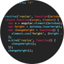

# Monokai Dark Soda
[](https://img.shields.io/github/license/AdamCaviness/vs-code-theme-monokai-dark-soda)
[](https://github.com/AdamCaviness/vs-code-theme-monokai-dark-soda/issues)
[](https://github.com/AdamCaviness/vs-code-theme-monokai-dark-soda/fork)
[](https://github.com/AdamCaviness/vs-code-theme-monokai-dark-soda/stargazers)


> This theme is based on the excellent [Monokai Dark Soda textmate theme](https://github.com/mrlundis/Monokai-Dark-Soda.tmTheme).



## Installation

Launch VS Code Quick Open (Ctrl+P), paste the following command, and press enter.

```sh
ext install AdamCaviness.theme-monokai-dark-soda
```

## Color Palette

Palette      | Hex       | RGB           | HSL             | 
---          | ---       | ---           | ---             | ---
Background   | `#242424` | `36 36 36`    | `0, 0%, 14%`  | 
Current Line | `#3D3D3D` | `61, 61, 61`    | `0, 0%, 24%`  | 
Selection    | `#403d3d` | `64, 61, 61`    | `0, 5%, 25%`  | 
Comment      | `#8C8C8C` | `140, 140, 140`  | `0, 0%, 55%`  | 
Foreground   | `#F8F8F2` | `248, 248, 242` | `60, 2%, 96%`   | 
String      | `#FFEE99` | `255, 238, 153`  | `50, 40%, 80%`  | 
Number      | `#FF80F4` | `255, 128, 244`  | `305, 50%, 75%`  | 
Thunderbird      | `#D3201F` | `211, 32, 31`  | `30, 85%, 47%`  | 
Radical Red      | `#F92672` | `249, 38, 114`  | `338, 85%, 56%`  | 
Fuchsia Pink     | `#CD5AC5` | `205, 90, 197`  | `304, 56%, 58%`  | 
Lavender Rose      | `#FFB2F9` | `255, 178, 249`  | `305, 30%, 85%`  | 
Tree Poppy      | `#FD971F` | `253, 151, 31`  | `32, 88%, 56%`  | 
Atlantis     | `#60cf30` | `96, 207, 48`  | `102, 77%, 50%`  | 
Pear      | `#A6E22E` | `166, 226, 46`  | `80, 80%, 53%`  | 
Spray      | `#66D9EF` | `102, 217, 239`  | `190, 57%, 67%`  | 
Malibu      | `#90E7F7` | `144, 231, 247`  | `189, 42%, 77%`  | 


#### Want more?

#### Open an [issue](https://github.com/AdamCaviness/vs-code-theme-monokai-dark-soda/issues/new)!

## Contributing

1. Fork it [vs-code-theme-monokai-dark-soda ](https://github.com/AdamCaviness/vs-code-theme-monokai-dark-soda/fork)
2. Create your feature branch (`git checkout -b feature/fooBar`)
3. Commit your changes (`git commit -am 'Add some fooBar'`)
4. Push to the branch (`git push origin feature/fooBar`)
5. Create a new Pull Request

License
---

The MIT License. Read [LICENSE](LICENSE) for further information.
